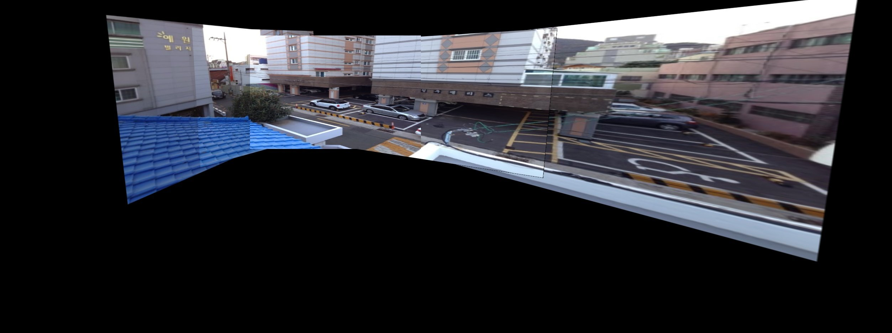
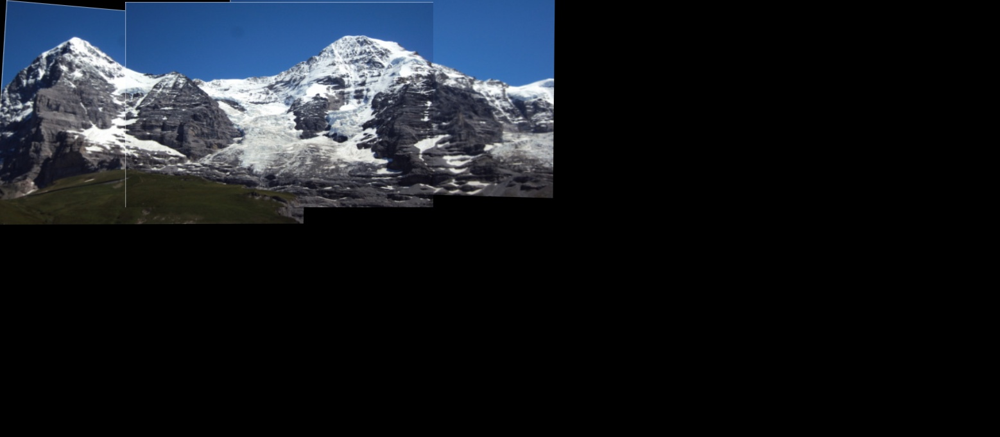
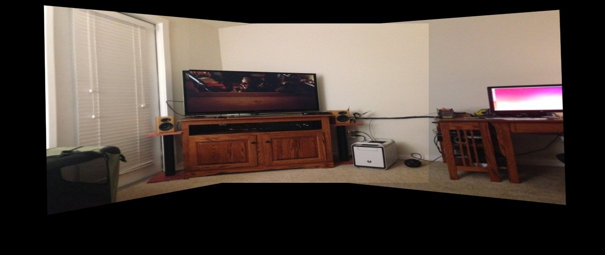

# Multiple Image stitching in Python

This repository contains an implementation of multiple image stitching. For explanation refer my blog post : [Creating a panorama using multiple images](http://kushalvyas.github.io/stitching.html)

Requirements : 

- Python 2.7
- Numpy >= 1.8 
- OpenCV 3.1.0 

Project Structure : 
	
		|_ code -|
		|		 |-- pano.py
		|		 |-- txtlists-|
		|		 			  |--files1.txt .... 
		|	
		|_ images - |
		|			|- img1.jpg
		|			|- abc.jpg 
		|			.... and so on ... 

Demo txtfile : 
files2.txt :

        ../../images/1.jpg
        ../../images/2.jpg
        ../../images/3.jpg
        ../../images/4.jpg

To run : 

    `python pano.py <txtlists/filename_.txt>`

Outputs !! 

 
<caption>Stitching with building example</caption>
  
 
<caption>Stitching using Hill example</caption>
  
 
<caption>Stitching using room example</caption>
 

### Other WebSources for Images : 
I have used a few sample images from other sources as well.

Test images taken from :

[2] "OpenCV Stitching example (Stitcher class, Panorama)", Study.marearts.com, 2013. [Online]. Available: http://study.marearts.com/2013/11/opencv-stitching-example-stitcher-class.html.

[3] "Github daeyun Image-Stitching Test Images", 2016. [Online]. Available: https://github.com/daeyun/Image-Stitching/tree/master/img/hill. 

[4] "Github tsherlock Test Images", 2016. [Online]. Available: .  https://github.com/tsherlock/panorama/